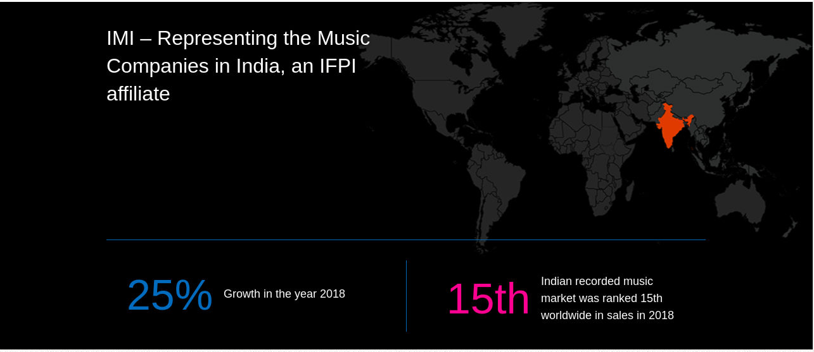
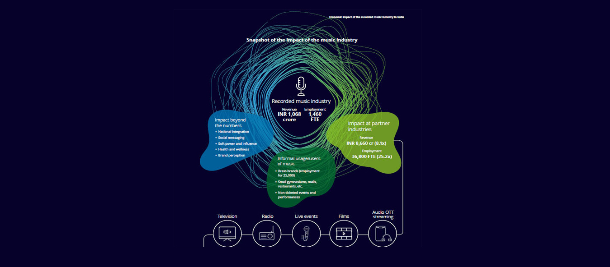

# Gayana

    
## Intro to DAO
Decentralized Autonomous Organization(DAO) are self governing organizations which are not affected by things that happen around the world. They are operational software with the by-laws that are immutably written on the blockchain and are not in the hands of its creator. These organizations are created by like minded people with an agenda/goal on a specific project. Its Identity is made through consensus and its authority is made by voluntary endorsements and network effects.

## Our DAO 

This DAO that I am trying to purpose is on the sole purpose to work on the dead music industry of India and help it move forward. In the current music industry we have just 2-3 companies that have the so called power to adopt songs in movies and whatsoever is allowed inside songs as a whole. The corporate big shots behind the so called companies are in the only motive to dominate the music society and not let the talent sprout. They want any and everyone who is under them to be successful. Also the problem of nepotism is not something new in this industry. 
As we all know inside DAO there is no central authority, so we need not worry about someone trying to just push unwanted talent in the industry. 

## Execution 

The operation of our DAO will be really simple but would be using the voting system of DAO to publish songs under the name of our gayama as a company. The profit of service or product will be distributed in the way that people support the song. People who vote for the proposal of the song will be entitled to the profits on the song. 

The process of music published by gayana is simple and follows this steps - 
  - Publisher has to join Gayana by getting some Gayana Tokens.
  - the artist can then upload their work and send it to Gayana as a proposal. 
  - Debate is done on the proposal by artist on any on/off chain platform like slack. 
  - After debating people vote for the proposal, If the proposal is accepted then a formal contract will be made     by code and the song will be published. 

## Facts and Traction 

With these figures and a growth perspective as high as this we can surely assume that the business will see a catastrophic rise.So we should work upon this as in the case right now i only see several big corporations ruling this industry.A platform like ours can help people with real talent to earn a decent amount of cash and would in turn also help the people which are backing the person using “Gayana”

